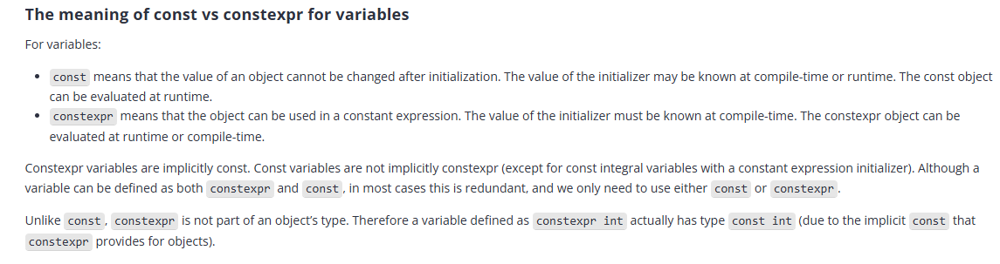
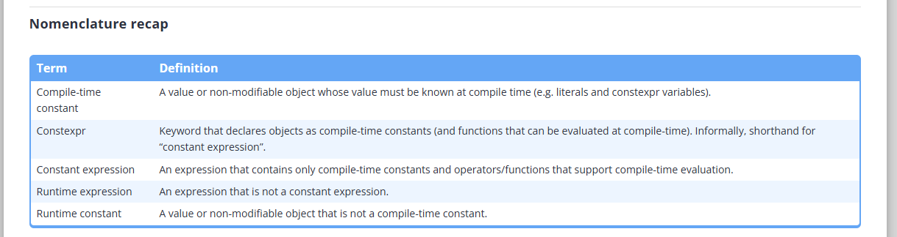

[https://www.learncpp.com/](https://www.learncpp.com/)

## Resumos
[https://www.learncpp.com/cpp-tutorial/chapter-1-summary-and-quiz/](https://www.learncpp.com/cpp-tutorial/chapter-1-summary-and-quiz/)

# Estudos

## Diagrama de processo de compilação C++

## Operadores:

## Diretivas

## Arquivos de cabeçalhos

## Tipos de dados primitivos do C++

## Sistema numérico

## constexper

## Strings

## Precedência de operadores e associatividade

## Operadores Bit A Bit

## Escopo, Duração e Link resumo

## Controle de fluxo

## Tipos de conversão

## Sobrecarga de função

